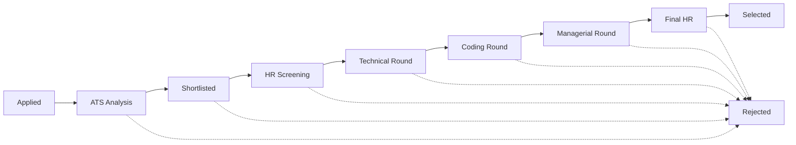

<div align="center">

# 🎯 Recruitment & Interview Management System

**An end-to-end hiring platform — resume parsing, ATS scoring, application pipelines, and interview scheduling, in one place.**


</div>

---

## 📖 About

Hiring usually means juggling resumes, spreadsheets, and email threads
across a dozen tools. This project puts the whole cycle in one system: a
candidate uploads a resume, the platform parses it and scores it against a
job's requirements (ATS-style), HR moves the application through a defined
pipeline, interviews get scheduled with automatic conflict checks, and
interviewers submit structured feedback — all visible in real time from
role-specific dashboards for **Admin**, **HR**, **Interviewer**, and
**Candidate**.

## 📑 Table of Contents

- [Features](#-features)
- [Tech Stack](#-tech-stack)
- [How the Pipeline Works](#-how-the-pipeline-works)
- [Project Structure](#-project-structure)
- [Getting Started](#-getting-started)
- [Demo Data](#-demo-data)
- [User Roles](#-user-roles)
- [API Overview](#-api-overview)
- [Screenshots](#-screenshots)
- [Roadmap](#-roadmap)
- [Author](#-author)

## ✨ Features

**Candidates**
- Build a profile and upload a resume (PDF/DOCX) — parsed automatically
- Get a recommended department based on resume content
- Browse open jobs and apply with one click
- Track every application's status and upcoming interviews in real time

**HR & Admin**
- Post and manage jobs with weighted required skills
- Search and filter candidates by skill, department, ATS score, and status
- Move applications through a defined pipeline with one click
- Schedule interviews with automatic double-booking conflict checks
- View candidates ranked by ATS score for any job
- Department-wise and pipeline-funnel analytics dashboards

**Interviewers**
- See assigned interviews in one place
- Submit structured feedback (technical knowledge, communication, problem
  solving, coding, confidence) with a recommendation

**Under the hood**
- ATS scoring engine — weighted match across skills, experience,
  education, projects, certifications, and keywords
- Notification system for application, interview, and feedback events
- JWT-based authentication with role-based permissions

## 🛠 Tech Stack

| Layer     | Technology |
|-----------|------------|
| Backend   | Django, Django REST Framework, Simple JWT |
| Database  | MySQL |
| Frontend  | HTML, CSS, vanilla JavaScript |
| Charts / Calendar | Chart.js, FullCalendar |

## 🔄 How the Pipeline Works

An application moves through a fixed state machine — HR can only move it
forward one step at a time, or reject it at any point:



## 📂 Project Structure

```
interview_management/
├── backend/            # Django project — REST API, models, ATS logic
│   ├── accounts/       # Custom User model, auth, roles
│   ├── ...             # departments, jobs, applications, interviews, ats
│   └── manage.py
├── frontend/            # Static HTML/CSS/JS client (role-based dashboards)
│   ├── admin/  hr/  interviewer/  candidate/
│   ├── css/    js/
│   └── login.html  register.html  index.html
└── seed_data/           # Script + sample resumes to populate demo data
    ├── generate_resumes.py
    ├── seed_data.py
    └── resumes/
```

## 🚀 Getting Started

### 1. Backend

```bash
cd backend
python -m venv venv
venv\Scripts\activate          # Windows
source venv/bin/activate       # macOS/Linux

pip install -r requirements.txt

# configure your MySQL database + secret key in settings.py or a .env file

python manage.py migrate
python manage.py createsuperuser
python manage.py runserver
```

API runs at `http://127.0.0.1:8000/`.

### 2. Frontend

The frontend is static — no build step needed.

```bash
cd frontend
python -m http.server 5500
```

Open `http://127.0.0.1:5500/` in your browser. Make sure `API_BASE` in
`frontend/js/api.js` points at your running backend URL.

## 🌱 Demo Data

To populate the system with 6 sample candidates (real parsed resumes),
matching jobs, and applications already moved through the pipeline to a mix
of outcomes (selected / rejected / in-progress), see
[`seed_data/README.md`](./seed_data/README.md).

## 👥 User Roles

| Role        | Can do |
|-------------|--------|
| **Admin**       | Manage departments, jobs, candidates; view analytics |
| **HR**          | Manage jobs, review applications, schedule interviews, move candidates through the pipeline |
| **Interviewer** | View assigned interviews, submit feedback |
| **Candidate**   | Build profile, upload resume, browse jobs, apply, track status |

## 🔌 API Overview

| Group | Examples |
|-------|----------|
| Auth | `/api/auth/register/`, `/api/auth/login/`, `/api/auth/refresh/` |
| Departments | `/api/departments/` |
| Jobs | `/api/jobs/` |
| Candidates | `/api/candidates/me/`, `/api/candidates/search/` |
| Resumes | `/api/resumes/upload/`, `/api/resumes/{id}/download/` |
| ATS | `/api/ats/score/`, `/api/ats/resumes/{id}/extract-skills/`, `/api/ats/candidates/{id}/recommend-department/` |
| Applications | `/api/applications/`, `/api/applications/{id}/status/`, `/api/applications/rank/` |
| Interviews | `/api/interviews/`, `/api/interviews/feedback/` |
| Notifications | `/api/notifications/`, `/api/notifications/mark-all-read/` |
| Analytics | `/api/analytics/overview/`, `/api/analytics/candidate-summary/` |

## 📸 Screenshots

_ 


## 🗺 Roadmap

- [ ] Email notifications alongside in-app notifications
- [ ] Bulk resume upload for HR
- [ ] Richer analytics (time-to-hire, source of hire)
- [ ] Automated interviewer listing in the scheduling form

 